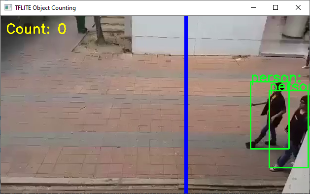
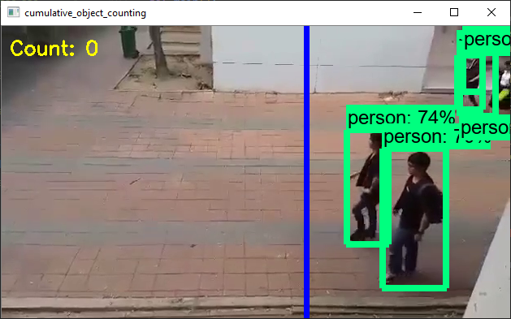

# Tensorflow 2 Object Counting

Cummulative object counting with Tensorflow 2 and Tensorflow Lite.



## Installation

1. Clone the repository 
   ```git clone https://github.com/TannerGilbert/Tensorflow-2-Object-Counting```

2. [Install the Tensorflow Object Detection API](https://github.com/tensorflow/models/blob/master/research/object_detection/g3doc/tf2.md#installation)

3. Install dependencies
   ```
   cd Tensorflow-2-Object-Counting
   pip3 install -r requirements.txt
   ```

## Cumulative counting with Tensorflow

To run cumulative counting with a Tensorflow object detection model use the [`tensorflow_cumulative_object_counting.py` script](tensorflow_cumulative_object_counting.py).

```
usage: tensorflow_cumulative_object_counting.py [-h] -m MODEL -l LABELMAP [-v VIDEO_PATH] [-t THRESHOLD] [-roi ROI_POSITION] [-d DEVIATION] [-la LABELS [LABELS ...]] [-a]

Detect objects inside webcam videostream

optional arguments:
  -h, --help            show this help message and exit
  -m MODEL, --model MODEL
                        Model Path
  -l LABELMAP, --labelmap LABELMAP
                        Path to Labelmap
  -v VIDEO_PATH, --video_path VIDEO_PATH
                        Path to video. If None camera will be used
  -t THRESHOLD, --threshold THRESHOLD
                        Detection threshold
  -roi ROI_POSITION, --roi_position ROI_POSITION
                        ROI Position (0-1)
  -d DEVIATION, --deviation DEVIATION
                        Deviation (0-1)
  -la LABELS [LABELS ...], --labels LABELS [LABELS ...]
                        Label names to detect (default="all-labels")
  -a, --axis            Axis for cumulative counting (default=x axis)
```

Example:
    `python tensorflow_cumulative_object_counting.py -m model_path/saved_model -l labelmap.pbtxt -v video.mp4`



## Cumulative counting with Tensorflow Lite

To run cumulative counting with a Tensorflow Lite model use the [`tflite_cumulative_object_counting.py` script](tflite_cumulative_object_counting.py).

```
usage: tflite_cumulative_object_counting.py [-h] -m MODEL -l LABELMAP [-v VIDEO_PATH] [-t THRESHOLD] [-roi ROI_POSITION] [-d DEVIATION] [-la LABELS [LABELS ...]] [-a] [-e]

optional arguments:
  -h, --help            show this help message and exit
  -m MODEL, --model MODEL
                        File path of .tflite file. (default: None)
  -l LABELMAP, --labelmap LABELMAP
                        File path of labels file. (default: None)
  -v VIDEO_PATH, --video_path VIDEO_PATH
                        Path to video. If None camera will be used (default: )
  -t THRESHOLD, --threshold THRESHOLD
                        Score threshold for detected objects. (default: 0.5)
  -roi ROI_POSITION, --roi_position ROI_POSITION
                        ROI Position (0-1) (default: 0.6)
  -d DEVIATION, --deviation DEVIATION
                        Deviation (0-1) (default: 0.005)
  -la LABELS [LABELS ...], --labels LABELS [LABELS ...]
                        Label names to detect (default="all-labels") (default: None)
  -a, --axis            Axis for cumulative counting (default=x axis) (default: True)
  -e, --use_edgetpu     Use EdgeTPU (default: False)
```

Example:
    `python tflite_cumulative_object_counting.py -m model.tflite -l labelmap.txt -v video.mp4`


## Inspired by / Based on

This project was inspired by the [tensorflow_object_counting_api](https://github.com/ahmetozlu/tensorflow_object_counting_api) from Github user [ahmetozlu](https://github.com/ahmetozlu).